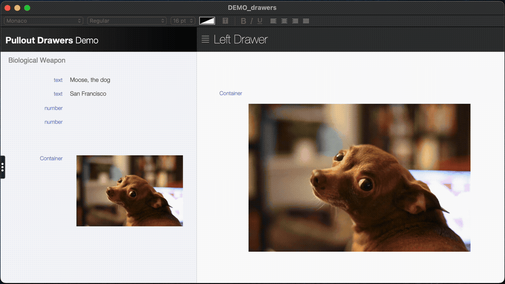
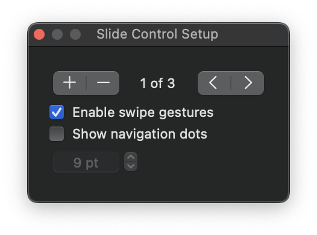
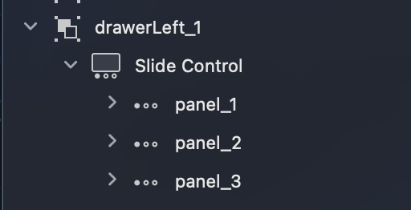
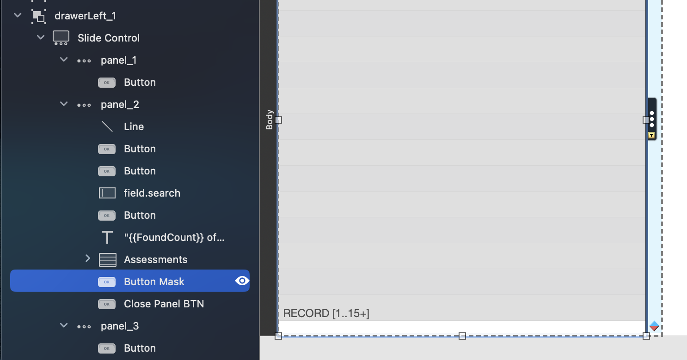
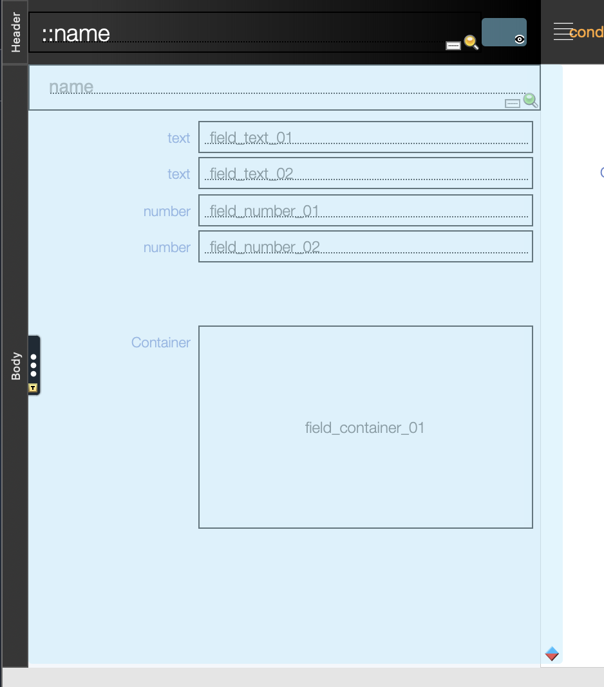
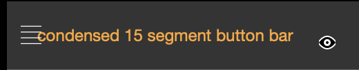

# Slide Out Drawers

Proof of concept for slide out drawer interfaces in FileMaker Pro, with the option for a modal drawer.

[DEMO_drawers.fmp12](DEMO_drawers.fmp12)

## Slide Panel Components
Slide panel objects represent open and closed states of the drawer. Navigating between the panels animates the drawer opening and closing.

#### Object Grouping and Naming

Each of the slide panels need to be named, so that they can be navigated to via script. The parent slide control object needs to be the only object in a named group. This is done by crerating a temporary object, could be anything (e.g. a text object, a button, a rectangle). This temporary object is grouped with the slide control. The temporary object is then deleted, leaving only the slide control in the group. 

This named grouped gives us an object to query, from which we can programitically gather our slide panel names, rather than hard code them.

#### Button Mask

Each "open drawer" slide panel has a button object beneath all other contained objects. A single "Exit Script" step is assigned. This 'false target' provides a mask for the underlying layout objects, preventing the user from focusing on any fields or buttons beneath the open drawer.

#### Navigating Between Panels

Drawer open and close buttons, on each panel, all call the same script, varying only by passed in parameters.

- SOURCE_PANEL  [number] : originating panel index number
- PANEL_LIST    [return delimited list] : list of the panel names in the current slide control object
- RIGHT         [boolean] : indicator that drawer opens from right margin, rather than left

### Right Drawers
The most straightforward implementation, there are only two slide panel, one for open, one for closed. The first panel is the default panel, on navigating to the layout; so, this is our closed panel.

The second panel represents the open drawer, and will conveniently slide in from the right, when navigated to.

### Left Drawers
Left margin drawers present the complication of sliding in from the wrong direction; from the right. To address this, a third panel, another "closed" panel is added. On initially landing on the layout, the first panel is shown by default. If the open button is clicked, we navigate the user to the third panel, before proceeding to the second, thus the "open" panel sliding in from the left margin.

### Modality
The drawer opening and closing script sets a global memory variable which may be employed in a visibility calculation on a "modality curtain". An example is provided with the right drawer. A button object is again employed to prevent user click-through.

### DrawerPanels ( ) Custom Function
The panel naviagtion script requires a list of slide panel names. Hard coding these into the script parameter would be onerous for code maintainence, and simply too fragile. By containing the slide control object in its own named group, we can then employ a custom function to derive the object names of the contained panels. The then only need to ensure that the object name of the group is correctly passed. All other objects can be freely renamed, and the function is portable.

    /*       __________________________________________________

    NAME:	    DrawerPanels ( SlideControlGroupName )
    PURPOSE:    Returns error code corresponding to a user canceling an action.
    PARAMETERS:
		    SlideControlGroupName : name of group containing slide control object
    EXAMPLE:    Given a group named "drawer_left" containing a slide control object, with panels named "panel_01", "panel_02", and "panel_03".
		    DrawerPanels ( "drawer_left" ) = "panel_01¶panel_02¶panel_03"
    HISTORY:
	    14 Jul 2025, 22hr51PST, Lon Cook : created	
    */

    While ([ 
	// I N I T I A L I Z E   V A R I A B L E S
	  _drawerGroupName		= SlideControlGroupName
	; _objectAttribute		= GetLayoutObjectAttribute ( _drawerGroupName ; "containedObjects" )
	; _string		        = ""
	; _string_withTags		= ""
	; _closeTag_count		= PatternCount ( _objectAttribute ; ">" )
	]; 
	// C O N D I T I O N
	  _closeTag_count > 0 
	;[ 
	// L O G I C
	   _string			= TextBetween (
	  					  _objectAttribute
						; "<"
						; ">"
						; 1
						)
	; _string_withTags		= "<" & _string & ">"
	; _objectAttribute		= Substitute ( _objectAttribute ; _string_withTags ; "" )
	; _closeTag_count		= PatternCount ( _objectAttribute ; ">" )
	]; 

	// R E S U L T
	  Substitute ( _objectAttribute ; "¶¶" ; "¶" )
    )

## Layout Object Visibility
Objects, like sliding drawers and popovers, can get lost on an interface, when not visible. We can do ourselves a favor and make these objects visible in Layout Mode. Underlying objects are not obscured, while remaining readily apparent themselves. The formatting applied here is a transparent cyan.

### Conditional Formatting
For objcets that need to be rendered on screen, but have transparent properties that could make them difficult to readily find in Layout Mode, conditional formating is your friend. Formatting can be applied to the object (example: semi-transparent cyan), with conditional formatting to render the object fully transparent when not in layout mode. That calculation is as follows:

    Get ( WindowMode ) ≠ 4

This also works well for leaving developer notes, only visible in Layout Mode.

### Visibility Calculation
For objects you dont want to render at all, but still be able to find in Layout Mode, we turn to the visibilty calculation; also known as "Hide object when".

In this file, the navigation menu is driven by a popover object, which are ordinarily called by a button. Here we are opening the popover object via script. We want the popover, but dont need the button it's attached to. We still need to find the button, when in Layout Mode, so it's given the same formatting as objects hidden via conditional formatting.

The visibility calculation is the same one employed in the conditional formatting:

    Get ( WindowMode ) ≠ 4